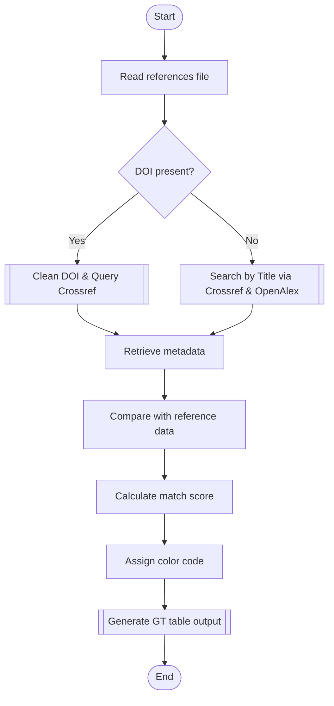

# Reference Verifier in R

Parse, verify, and highlight questionable academic references — catch fabricated or erroneous citations before they catch you.

## 📚 Overview

`ref-verifier` is an R-based utility that validates bibliographic references by:

- Parsing plain-text references (APA, MLA, Chicago)
- Verifying DOIs via the [Crossref API](https://api.crossref.org)
- Cross-checking publisher and ISSN metadata
- Running title searches via Crossref and [OpenAlex](https://docs.openalex.org/api) if DOI is missing or invalid
- Scoring matches using title similarity, author surname overlap, and year proximity
- Producing a color-coded [`gt`](https://gt.rstudio.com/) table for quick review

Designed for academics, editors, and reviewers to spot typos, mismatches, or fabricated citations.

---

## 🛠 Usage

### Step 1 — Prepare your references file
Create a plain-text file (e.g., `references.txt`) with **one reference per line**.  
DOIs may be included or omitted.

Example:
```
Smith, J. (2020). Example Article. Journal of Examples, 12(3), 45–56. https://doi.org/10.1234/example
Doe, A. (2019). Another Study. Example Journal, 5(2), 100–110.
```

### Step 2 — Run the verifier
```r
source("ref-verifier.R")
results <- verify_references("references.txt")
```

### Step 3 — Review the output
View in RStudio’s Viewer pane or export to HTML:
```r
gt::gtsave(results, "verification_report.html")
```

**Color codes:**
- 🟢 Green — high confidence match
- 🟡 Yellow — partial match or minor discrepancies
- 🔴 Red — likely incorrect or fabricated

---

## 📂 Example Session

```r
# Load the script
source("ref-verifier.R")

# Verify references from file
results <- verify_references("my_refs.txt")

# Save the report
gt::gtsave(results, "my_report.html")
```
Open `my_report.html` in your browser to view the results.

---

## 🚀 Installation

1. **Clone the repository**
    ```bash
    git clone https://github.com/salvatoremaione/ref-verifier.git
    cd ref-verifier
    ```

2. **Install required R packages**
    ```r
    install.packages(c(
      "dplyr", "purrr", "tibble", "readr", "stringi",
      "stringdist", "httr", "jsonlite", "stringr", "gt"
    ))
    ```

3. **Open the project**  
   Use R or RStudio in the cloned project directory.

---

## 🧠 How It Works



**Step breakdown:**
1. **DOI Check** — Cleans DOI (if present) and queries [Crossref](https://api.crossref.org) for metadata.
2. **Metadata Match** — Compares publisher, ISSN, year, and title for mismatches.
3. **Fallback Search** — Uses [Crossref](https://api.crossref.org) and [OpenAlex](https://docs.openalex.org/api) title search if DOI fails or is missing.
4. **Scoring** — Combines:
   - Title similarity (string distance)
   - Author surname overlap
   - Year proximity
5. **Color Coding** — Assigns traffic-light colors for quick match confidence review.
6. **Output** — Generates a [`gt`](https://gt.rstudio.com/) table for easy inspection.

---

## ⚠️ Limitations

- Requires internet access for API queries
- Accuracy depends on metadata quality in Crossref/OpenAlex
- Non-English references may have lower match accuracy

---

## 📜 License

MIT License — see [LICENSE](LICENSE) for details.
